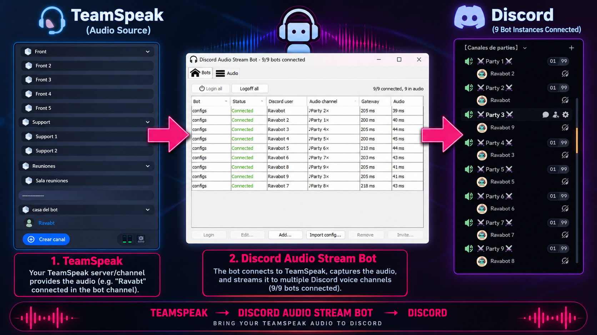

# Discord Audio Stream Bot — multi-bot edition
>Capture any audio device on your PC and stream it into **several Discord voice channels at once**, from a single window.

Fork of [BinkanSalaryman/Discord-Audio-Stream-Bot](https://github.com/BinkanSalaryman/Discord-Audio-Stream-Bot) (unmaintained).
This fork keeps the bot working with today's Discord (JDA 6.3, DAVE end-to-end encrypted voice, Java 25) and adds **multi-bot mode**:
one program, one audio capture, N bot accounts, N voice channels.



## Why: one caller, many parties (TeamSpeak → Discord)

The original bot solves "get my microphone / game audio into a Discord channel". This fork was built for a different problem:
**relaying one voice into many Discord channels at the same time**.

Our use case is raid communication in Lineage II. Raids of 60+ players are split into parties of 9, each party living in its own
Discord voice channel. The raid leader has to be heard by *every* party, but Discord has no whisper/broadcast across channels and a
bot account can only sit in one voice channel per server. So:

1. **TeamSpeak** is the broadcast layer. The raid leader and one representative per party sit on a TeamSpeak server, where whispers
   and cross-channel talk are trivial. The leader whispers to a "bot" TeamSpeak user (`Ravabt` in the picture) that runs on the PC
   hosting this program.
2. **Discord Audio Stream Bot** runs on that PC. TeamSpeak's output is routed into a virtual audio cable
   ([VB-Cable](https://www.vb-audio.com/Cable/index.htm)); the program captures the cable's *output* device **once** and fans the
   samples out to every bot it manages.
3. **Discord** receives the leader's voice in every party channel simultaneously, one bot account per channel (`Ravabot 1..9`).

Any other source works the same way: Mumble, a second Discord account, a game, a music player. Whatever plays into the cable is broadcast.

Before multi-bot mode this meant 9 copies of the program, 9 JVMs, 9 launch scripts and a couple of minutes of startup.
Now it is one window: start it and all bots are connected and in their channels within seconds.

## What multi-bot mode gives you

* **Bots tab** — one row per bot account: login status, Discord user, current voice channel, gateway and audio ping.
* **Login all / Logoff all**, or per-bot **Login / Logoff**. Bots marked *auto login* connect when the program starts.
* **Add...** — name, token, auto login, server (guild) id and an optional auto-join voice channel id.
* **Edit...** (or double-click) and **Remove**.
* **Import config...** — pick the `config.json` files of older single-bot installations (multi-select) and they are added as bots,
  named after their folder. Handy for migrating an existing fleet.
* **Invite...** — opens the invite url of the selected bot in the browser.
* **Audio tab** — mute/unmute, recording device, voice-activity threshold. Shared by every bot, changed once.
* Slash commands (`/join`, `/leave`, `/autojoin`, `/follow-audio`, `/bind`, ...) still work and act on the bot you send them to.

Under the hood a single BASS recording stream is opened per device and shared by all bots. A bot leaving a channel no longer
frees the device for the others (that was a latent bug in the original when one bot served several servers).

## Getting started

### 1. Bot users (one per voice channel you want to reach)
For each bot:
* Create a Discord application in the [developer portal](https://discord.com/developers/applications), add a bot user, copy its token.
* Enable the **Server Members Intent** (needed to check permissions of the user issuing a command).
* Invite it to your server (the program's *Invite...* button gives you the url once the bot is logged in, or build one in the portal
  with the `bot` and `applications.commands` scopes).

### 2. Audio routing
* Install [VB-Cable](https://www.vb-audio.com/Cable/index.htm) (or any virtual audio device).
* Make the source play into **CABLE Input**. In TeamSpeak: *Options → Playback → Playback device → CABLE Input*.
  You will not hear TeamSpeak yourself on that PC; that is the point, the bot PC is a relay.
* The program will capture **CABLE Output**.

### 3. The program
* Install a Java 25 (or newer) JDK/JRE matching your OS architecture and make sure `java`/`javaw` are on the `PATH`.
* Unzip a release (jar + `natives/` + `runwin.bat`) into a folder and run **runwin.bat** (Windows).
* **Bots** tab → **Add...** for each bot (or **Import config...** if you are coming from single-bot installs). Tick *auto login*
  and set the guild id and the voice channel id each bot should join (right-click → *Copy ID* in Discord with developer mode on).
* **Audio** tab → unmute, select *CABLE Output* as recording device.
* **Login all**. Each bot logs in, joins its channel and starts streaming.
* From now on it is: start the program, done. Put a shortcut to `runwin.bat` in `shell:startup` if you want it at boot.

### 4. Commands
Type `/` in a channel shared with a bot to see its commands. The most useful ones:
* `/join [channel]` / `/leave` — move the bot in/out of a voice channel.
* `/autojoin op:set channel:<voice channel>` — remember a channel to join right after login (same as the GUI field).
* `/follow-audio op:set user:<user>` — make the bot follow a user between voice channels.
* `/bind` — restrict which text channels accept commands.
* `/about`, `/invite`, `/status`, `/activity`, `/stop`, `/exit`.

## `config.json`
Written next to the jar. Tokens are stored in plain text, so keep the folder private.
```json
{
  "speakEnabled": true,
  "recordingDevice": "CABLE Output (VB-Audio Virtual Cable)",
  "speakThresholdEnabled": false,
  "speakThreshold": 0.45,
  "bots": [
    { "name": "Party 1", "botToken": "...", "autoLogin": true,
      "guildConfigs": [ { "guildId": "908409845592502293", "autoJoinAudioChannelId": "1429897324217237655" } ] },
    { "name": "Party 2", "botToken": "...", "autoLogin": true,
      "guildConfigs": [ { "guildId": "908409845592502293", "autoJoinAudioChannelId": "..." } ] }
  ]
}
```
A `config.json` from the original single-bot program (token at top level) is migrated to this layout automatically on first start.

## Building
Requires JDK 25 (the DAVE bindings use the FFM API) and Gradle 8.12+.
```
gradle shadowJar
```
produces `build/libs/Discord Audio Stream Bot.jar`. Run it next to the `natives/` folder:
```
javaw -Djava.library.path=natives/win64/ --add-exports=java.desktop/com.sun.java.swing.plaf.windows=ALL-UNNAMED --enable-native-access=ALL-UNNAMED -jar "Discord Audio Stream Bot.jar"
```
(`runwin.bat` does exactly this.) `gradle run` works too, see `build.gradle` for the per-OS native paths.

Only Windows x64 ships DAVE natives (`jdave-native-win-x86-64`). On Linux/macOS you need the matching `club.minnced:jdave-native-*`
artifact in `build.gradle`.

## Notes and known limits
* One bot account can be in one voice channel per server. Reaching N channels needs N bot accounts; that is what multi-bot mode manages.
* All bots share the same audio settings and the same recording device. Different sources per bot is not a goal of this fork.
* `app.log` is written at DEBUG level; with many bots it grows fast. Lower the level in `src/main/resources/logback.xml` if it bothers you.
* Listening (Discord → PC playback) is still supported but was not the focus here.

## Credits
* [BinkanSalaryman](https://github.com/BinkanSalaryman/Discord-Audio-Stream-Bot) — the original bot.
* [JDA](https://github.com/discord-jda/JDA) and [jdave](https://github.com/MinnDevelopment/jdave) — Discord API and DAVE voice encryption.
* [BASS](https://www.un4seen.com/) via NativeBass — audio capture.
* [VB-Cable](https://www.vb-audio.com/Cable/index.htm) — the virtual cable that makes the relay possible.
